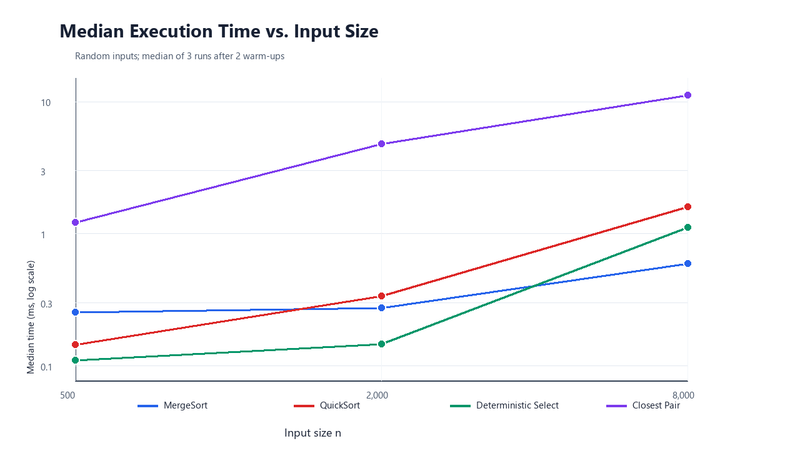
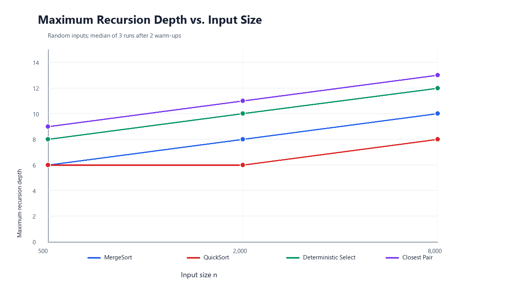

# Divide-and-Conquer Algorithm Analysis

## Project Overview

This project implements and measures four algorithms: MergeSort, randomized QuickSort, deterministic selection using Median-of-Medians, and the divide-and-conquer Closest Pair of Points algorithm.

## Build and Run

Requires Java 17 and Maven.

```bash
mvn test
mvn compile exec:java
```

The experiment saves its measurements to `results/results.csv` and its console output to `results/experiment-output.txt`.

## Algorithm Analysis

### MergeSort

MergeSort divides the array into two halves, sorts each half, and merges them with one reusable auxiliary array. Parts of 16 elements or fewer use insertion sort. The merge step is skipped when the two sorted halves are already in order.

- Recurrence: `T(n) = 2T(n/2) + Θ(n)`
- Time: `Θ(n log n)` in the best, average, and worst cases
- Extra space: `Θ(n)` for the reusable buffer; recursion stack is `Θ(log n)`

The Master Theorem applies with `a = 2`, `b = 2`, and `f(n) = Θ(n)`, giving `Θ(n log n)`.

### QuickSort

QuickSort chooses a random pivot, partitions the array in place into values smaller than, equal to, and greater than the pivot, then processes the smaller partition recursively and the larger partition in a loop.

- Recurrence: `T(n) = T(k) + T(n-k-1) + Θ(n)` for a partition with `k` values below the pivot
- Expected time with a random pivot: `Θ(n log n)`; worst-case time: `Θ(n²)`
- Extra space: `Θ(log n)` recursion stack because only the smaller partition creates a recursive call

Balanced partitions give `Θ(n log n)`. Repeatedly very unbalanced partitions can still require `Θ(n²)` work, even though the smaller-first recursion keeps stack depth logarithmic.

### Deterministic Select (Median-of-Medians)

The selector divides the active range into groups of five, sorts each small group, moves the group medians together, and recursively selects their median as a pivot. A three-way in-place partition then removes the side that cannot contain the requested zero-based rank `k`.

- Recurrence: `T(n) ≤ T(ceil(n/5)) + T(7n/10 + O(1)) + Θ(n)`
- Worst-case time: `Θ(n)`
- Extra space: `O(log n)` recursion stack; partitioning is in place

The Master Theorem does not directly handle this recurrence. Akra–Bazzi intuition gives a linear bound: the recursive fractions sum to `1/5 + 7/10 = 0.9`, while each level does only linear partitioning work. The pivot therefore discards a fixed fraction of the elements in the worst case.

### Closest Pair of Points

The solver sorts points by x-coordinate and by y-coordinate, divides the x-sorted points in half, and finds the best pair in each half. It then scans the points in the central strip in y-order, checking at most the next seven points for each point.

- Recurrence: `T(n) = 2T(n/2) + Θ(n)`
- Time: `Θ(n log n)`
- Extra space: `Θ(n)` for y-ordered subarrays and strip storage; recursion stack is `Θ(log n)`

The linear work at each level partitions points by y-order and checks a constant number of strip neighbors. The Master Theorem gives `Θ(n log n)`.

## Testing

`mvn test` runs the correctness suite. It compares both sorters with `Arrays.sort()` on required edge cases and 200 random arrays, checks 150 random selection arrays at three ranks each against sorted references, and compares Closest Pair with brute force on 120 random small datasets plus a 2,000-point dataset. Duplicate coordinates, invalid inputs, and vertical point sets are also checked.

Latest test run: **10 test methods passed; 0 failures; 0 errors**. Full output: `results/test-output.txt`.

## Experimental Results

Each case uses a fixed seed, two warm-up runs, and three measured runs. Input generation is outside the timed section. The table shows the median elapsed time and median maximum recursion depth for random inputs. Detailed results for all input types, including comparisons and swaps, are in `results/results.csv`. Closest Pair comparison counts are distance checks; comparisons performed inside Java's library sorting are not instrumented.

| Algorithm | n | Median time (ms) | Max recursion depth |
|---|---:|---:|---:|
| MergeSort | 500 | 0.255 | 6 |
| MergeSort | 2,000 | 0.276 | 8 |
| MergeSort | 8,000 | 0.596 | 10 |
| QuickSort | 500 | 0.145 | 6 |
| QuickSort | 2,000 | 0.338 | 6 |
| QuickSort | 8,000 | 1.603 | 8 |
| Deterministic Select | 500 | 0.111 | 8 |
| Deterministic Select | 2,000 | 0.147 | 10 |
| Deterministic Select | 8,000 | 1.114 | 12 |
| Closest Pair | 500 | 1.221 | 9 |
| Closest Pair | 2,000 | 4.834 | 11 |
| Closest Pair | 8,000 | 11.230 | 13 |





At `n = 8,000`, the median times in milliseconds by input type were:

| Algorithm | Random | Sorted | Reverse-sorted | Duplicate-heavy |
|---|---:|---:|---:|---:|
| MergeSort | 0.596 | 0.032 | 0.190 | 0.235 |
| QuickSort | 1.603 | 1.099 | 0.371 | 0.117 |
| Deterministic Select | 1.114 | 0.545 | 0.667 | 0.217 |
| Closest Pair | 11.230 | 3.892 | 4.818 | 5.530 |

The experimental environment was an AMD Ryzen 7 7840HS laptop with 16 GB RAM, Windows 11 Pro, and Microsoft OpenJDK 17.0.20.1. Timings use `System.nanoTime()` and can vary with JVM warm-up, operating-system scheduling, cache state, and garbage collection.

## Discussion

- The recursion-depth measurements grow slowly as `n` increases, consistent with logarithmic recursion depth for MergeSort and the smaller-first QuickSort. Closest Pair has a balanced divide-and-conquer tree. Select also performs recursive pivot selection, so its measured depth is higher than a single balanced search path.
- Sorted and reverse-sorted arrays change QuickSort's comparisons and swaps because the pivot positions are random. Duplicate-heavy arrays often finish faster because the three-way partition groups equal values in one pass.
- Recursing only on QuickSort's smaller partition limits the active call stack. The larger partition is processed by the loop, so even unbalanced partitions do not create a long chain of recursive calls.
- Groups of five make the Median-of-Medians pivot discard a constant fraction of the active values. Its recurrence has less than one total fraction of recursive work, leaving a linear worst-case bound.
- Closest Pair is faster asymptotically than checking every pair: it sorts and processes the points in `Θ(n log n)` instead of `Θ(n²)`. Its current Java implementation has higher constant costs from sorting point objects and temporary arrays, which is visible at these input sizes.
- Measurements follow the broad theoretical trends, but individual timings are noisy and do not prove asymptotic bounds. More repetitions and larger inputs would make scaling comparisons more reliable.

## Reflection

In this assignment, I learned how divide-and-conquer algorithms split a problem into smaller parts and combine their results. I also learned that algorithms can behave differently depending on the input, and that timing measurements can vary between runs.

The most difficult part was keeping the points in the right order in the Closest Pair algorithm. Testing the algorithms against simpler reference methods helped me check that their answers were correct. This project helped me connect the theory of algorithm complexity with results from a real Java program.

## Screenshots

Readable screenshots of the program output, test results, and plots are in `docs/screenshots/`. The plots are also available separately in `docs/plots/`. The CSV and original text logs are kept in `results/`.
